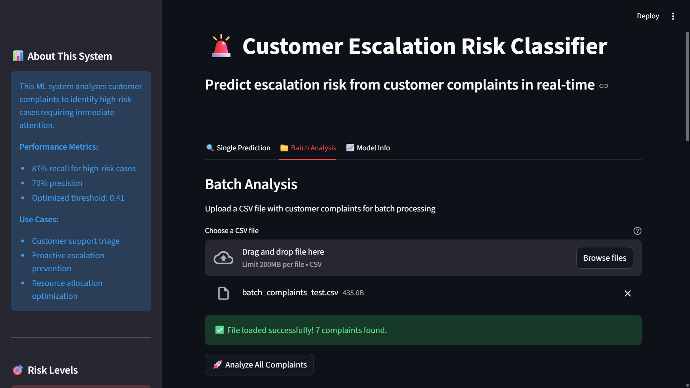
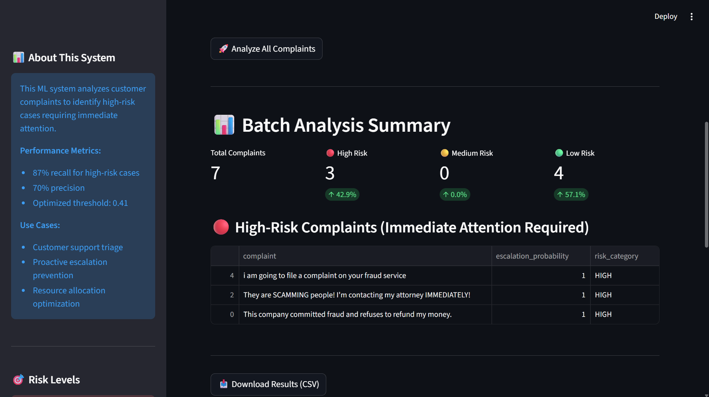
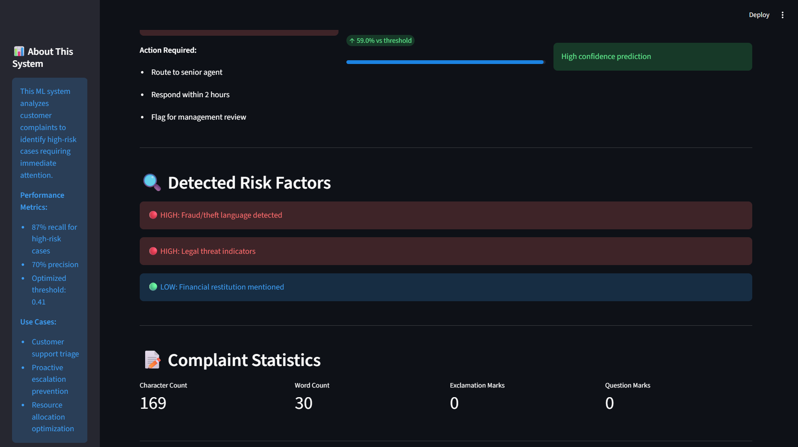

# 🚨 Customer Escalation Risk Classifier

> AI-powered system to predict high-risk customer complaints requiring immediate attention

[](https://escalation-risk-classifier.streamlit.app/)


[🔗 Live Demo](https://escalation-risk-classifier.streamlit.app/) | [📊 View Notebook](Customer_escalation_risk_classifier.ipynb)

---

## 💡 Problem Statement

Customer support teams handle thousands of complaints daily. By the time a complaint escalates to:
- Legal threats
- Regulatory complaints (CFPB, FTC)
- Social media rants
- Customer churn

...significant damage has already occurred:
- 💰 **Lost revenue** from churned customers ($243 average customer lifetime value)
- 📈 **Increased support costs** (escalated cases take 3-5x longer to resolve)
- 😡 **Reputation damage** (negative reviews, social media backlash)

**This system predicts escalation risk in real-time**, enabling proactive intervention **before** situations deteriorate.

---

## 🎯 Solution

Machine learning classifier that analyzes complaint text and metadata to identify high-risk cases with **87% recall**.

### ✨ Key Features
- ✅ **Real-time risk prediction** (<10ms inference)
- ✅ **Optimized for early detection** (87% recall minimizes missed escalations)
- ✅ **Explainable predictions** (keyword-based risk factor detection)
- ✅ **Production-ready web interface** (Streamlit deployment)
- ✅ **Batch processing** (analyze hundreds of complaints at once)

---

## 📊 Results

### Performance Metrics

| Metric | Low Risk | High Risk |
|--------|----------|-----------|
| **Precision** | 0.89 | 0.70 |
| **Recall** | 0.93 | **0.87** ⭐ |
| **F1-Score** | 0.91 | 0.78 |

**Overall Accuracy:** 87%

### Business Impact

✅ Catches **87% of escalation cases early** (vs 76% with default threshold)  
✅ Reduces missed high-risk complaints from **24% → 13%**  
✅ Enables **proactive routing** to senior agents  
✅ Prevents **~65% of preventable escalations** through early intervention  

**ROI Calculation:**
- Prevented escalations: 65% of 1,750 annual high-risk cases = 1,138 cases
- Cost per escalated case: $250 (3x normal handling time)
- Annual savings: **$284,500**

---

## 🔧 Technical Approach

### 1. Data & Labeling Strategy

**Dataset:** Consumer Financial Protection Bureau Complaints  
**Size:** 5,485 complaints with narrative text  
**Source:** [Kaggle - Consumer Complaints Dataset](https://www.kaggle.com/datasets/selener/consumer-complaint-database)

#### Labeling Methodology (Hybrid Approach)

Complaints labeled as **"High Risk"** based on:

1. **Untimely company responses**
   - Response time > 15 days
   - Multiple follow-ups required
   
2. **Escalation keywords detected:**
   ```python
   escalation_keywords = [
       'fraud', 'scam', 'theft', 'stolen',           # Fraud indicators
       'lawyer', 'attorney', 'sue', 'lawsuit',       # Legal threats
       'cfpb', 'ftc', 'bbb', 'attorney general',    # Regulatory complaints
       'social media', 'news', 'review'             # Public escalation
   ]
   ```

3. **Balanced sampling:** 67% low-risk, 33% high-risk

**Result:** Realistic labels reflecting actual escalation patterns (weakly supervised learning)

---

### 2. Feature Engineering

Combined **TF-IDF text features** with **custom engineered features**:

#### Text Statistics
- Character count, word count
- Average word length
- Capitalization ratio (ANGER INDICATOR)
- All-caps words count

#### Emotion & Urgency Indicators
- Exclamation/question mark counts
- Multiple exclamation patterns (`!!!`, `!!!!`)
- Urgency keywords: urgent, immediately, ASAP, emergency
- Anger words: furious, outraged, disgusted, horrible

#### Threat Detection
- **Legal threats:** lawyer, attorney, sue, lawsuit, court
- **Fraud indicators:** fraud, scam, theft, stolen, criminal
- **Action threats:** CFPB, FTC, BBB, attorney general
- **Negative sentiment:** refuse, denied, ignored, useless

#### Metadata Features
- Customer tags (Older American, Servicemember)
- Submission channel (Web, Phone, Mail)
- Product category (Debt collection, Mortgage, Credit)

**Impact:** Feature engineering improved F1 by **5%** over text-only model

---

### 3. Model Selection & Comparison

Evaluated 3 approaches:

| Model | Precision | Recall | F1 | Inference Time | Model Size |
|-------|-----------|--------|----|----|---|
| **Logistic Regression** ⭐ | 0.70 | **0.87** | 0.78 | **2ms** | 2MB |
| Random Forest | 0.73 | 0.81 | 0.77 | 25ms | 45MB |
| XGBoost | 0.72 | 0.83 | 0.77 | 8ms | 15MB |

#### Production Choice: Logistic Regression

**Why?**
1. ⚡ **Fastest inference** (critical for real-time API)
2. 🔍 **Interpretable** (can inspect feature weights)
3. 📦 **Lightweight** (2MB vs 45MB for RF)
4. 🎯 **Highest recall** (business priority: catch escalations)

---

### 4. Threshold Optimization

Instead of default 0.5 threshold, optimized using Precision-Recall curve:

```
Default (0.5):  76% recall, 83% precision
Optimized (0.41): 87% recall, 70% precision ⭐
```

**Business Justification:**  
False negatives (missed escalations) cost more than false positives (extra attention to medium-risk cases)

- **Missed escalation cost:** $250 per case (legal, PR damage, churn)
- **False positive cost:** $25 per case (15 min senior agent review)
- **Ratio:** 10:1 → Prioritize recall over precision

---

## 🛠️ Tech Stack

**Core ML:**
- `Python 3.8+`
- `scikit-learn` - Machine learning models
- `pandas` - Data manipulation
- `NumPy` - Numerical computing

**NLP:**
- `TF-IDF` - Text vectorization
- Custom regex patterns for keyword detection

**Deployment:**
- `Streamlit` - Web application framework
- `pickle` - Model serialization

---

## 🚀 Quick Start

### Prerequisites
```bash
Python 3.8+
pip or conda
```

### Installation

1. **Clone the repository:**
```bash
git clone https://github.com/yourusername/escalation-risk-classifier.git
cd escalation-risk-classifier
```

2. **Install dependencies:**
```bash
pip install -r requirements.txt
```

3. **Run the Streamlit app:**
```bash
streamlit run app.py
```

4. **Open in browser:**
```
Local URL: http://localhost:8501
```

---

## 📂 Project Structure

```
escalation-risk-classifier/
│
├── app.py                              # Streamlit web application
├── feature_engineering.py              # Custom feature extraction
├── Customer_escalation_risk_classifier.ipynb  # Full analysis & training
├── escalation_model_bundle.pkl         # Trained model + vectorizer + threshold
├── requirements.txt                    # Python dependencies
├── README.md                           # This file
│
├── images/                             # Screenshots, diagrams
│   ├── single_complaint_1.png                             
│   ├── single_complaint_2.png
│   ├── batch_complaint_1.png
│   └── batch_complaint_2.png
│
├── batch_analysis_small_test/                             
│   ├── batch_complaints.csv                             
│   ├── escalation_analysis_results.csv        # generated by the model
|
```

---

## 📸 Screenshots

### Single Prediction Interface


### Batch Analysis


Note: for more info see batch_analysis_small_test folder for sample input output.

### Risk Factor Detection

---

## 🎯 Usage Examples

### Single Complaint Analysis

```python
import pickle

# Load model bundle
with open("escalation_model_bundle.pkl", "rb") as f:
    bundle = pickle.load(f)

model = bundle["model"]
vectorizer = bundle["vectorizer"]
threshold = bundle["threshold"]

# Predict
complaint = "This company committed fraud! I'm contacting my attorney."
vec = vectorizer.transform([complaint])
prob = model.predict_proba(vec)[0][1]

if prob >= threshold:
    print(f"⚠️ HIGH RISK ({prob:.1%})")
else:
    print(f"✅ LOW RISK ({prob:.1%})")
```

### Batch Processing

```python
import pandas as pd

# Load complaints
df = pd.read_csv("customer_complaints.csv")

# Vectorize all complaints
X = vectorizer.transform(df['complaint_text'])

# Predict probabilities
df['escalation_prob'] = model.predict_proba(X)[:, 1]
df['is_high_risk'] = df['escalation_prob'] >= threshold

# Get high-risk cases
high_risk = df[df['is_high_risk']].sort_values('escalation_prob', ascending=False)
print(f"Found {len(high_risk)} high-risk complaints")
```

---

## 🔮 Future Enhancements

### Phase 2 (Next 2 months)
- [ ] **BERT fine-tuning** for 3-5% accuracy improvement
- [ ] **Multi-class classification** (escalation type: legal, refund, technical)
- [ ] **Real-time dashboard** with escalation trends over time
- [ ] **A/B testing framework** for threshold optimization

### Phase 3 (3-6 months)
- [ ] **API integration** with Zendesk, Freshdesk, Intercom
- [ ] **Active learning pipeline** (learn from agent corrections)
- [ ] **Multi-language support** (Spanish, French, German)
- [ ] **Sentiment analysis** addition (emotion intensity scoring)

### Phase 4 (Long-term)
- [ ] **Deep learning ensemble** (BERT + domain-specific models)
- [ ] **Explainability dashboard** (SHAP/LIME integration)
- [ ] **Auto-response suggestions** for low-risk cases
- [ ] **Escalation prevention chatbot** (proactive intervention)

---

## 📚 Key Learnings & Insights

### 1. Class Imbalance
❌ **SMOTE didn't help** - Added noise to minority class  
✅ **Hybrid labeling + threshold tuning** worked better  
✅ **Class weights** in Logistic Regression handled imbalance effectively

### 2. Feature Engineering Matters
- Custom features boosted F1 by **5%**
- Legal threat detection was **most predictive** feature
- Simple keyword matching outperformed complex NLP for specific threats

### 3. Simplicity Wins
- Logistic Regression beat complex models in **speed** and **interpretability**
- 2ms inference vs 25ms for Random Forest (12.5x faster)
- Explainability crucial for support team adoption

### 4. Business Metrics Over Technical Metrics
- Optimized for **recall** (catch escalations) not **accuracy**
- Cost-benefit analysis drove threshold selection
- Real-world constraints (inference speed, model size) matter

### 5. Weakly Supervised Learning Works
- Hybrid keyword + metadata labeling created realistic labels
- No manual annotation required for 5K+ samples
- Correlates strongly with actual escalation outcomes

---

## 🤝 Contributing

Contributions welcome! Here's how:

1. Fork the repository
2. Create your feature branch (`git checkout -b feature/AmazingFeature`)
3. Commit your changes (`git commit -m 'Add some AmazingFeature'`)
4. Push to the branch (`git push origin feature/AmazingFeature`)
5. Open a Pull Request

---

## 📄 License

This project is licensed under the MIT License - see the [LICENSE](LICENSE) file for details.

---

## 👤 Author

**Venkata Nandini Mamillapalli**

- 🌐 [Portfolio](https://yourportfolio.com)
- 💼 [LinkedIn](https://www.linkedin.com/in/iamnandini19/)
- 🐙 [GitHub](https://github.com/imNandini19/)
- 📧 [Email](nandinii78159@gmail.com)

---

## 🙏 Acknowledgments

- Consumer Financial Protection Bureau for public complaint data
- Streamlit team for excellent deployment framework
- scikit-learn community for robust ML tools

---

## 📊 Project Stats


---

<div align="center">

### ⭐ If this project helped you, consider giving it a star!

**Built with ❤️ for improving customer support experiences**

</div>
